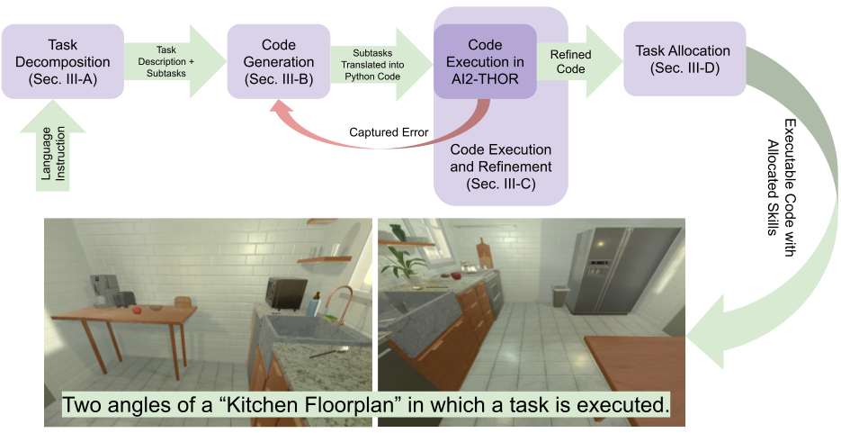

<p align="center">
  
</p>

<blockquote>
  <p align="justify">
    This paper investigates the potential of LLMs to facilitate planning in the context of human-robot collaborative tasks, 
    with a focus on their ability to reason from high-level, vague human inputs, and fine-tune plans based on real-time feedback. 
    We propose a novel hybrid framework that combines LLMs with human feedback to create dynamic, context-aware task plans.  
    Our work also highlights how a single, concise prompt can be used for a wide range of tasks and environments, 
    overcoming the limitations of long, detailed structured prompts typically used in prior studies.  
    By integrating user preferences into the planning loop, we ensure that the generated plans are not only effective 
    but aligned with human intentions. <br><br>
    <strong>IteraPlan</strong> consists of four main components: (1) Task Decomposition from Vague Instructions, (2) Translation of Task Plans into Executable Code, (3) Real-Time Execution and Adaptive Code Refinement, and (4) Affordance-Based Task Allocation.
  </p>
</blockquote>

# Running Experiments with IteraPlan

## Running `plan_with_llm.py`
To execute the script, use the following command:

```bash
python3 scripts/plan_with_llm.py --floor-plan <floor-plan-id> --exp-id <exp-id> --exp-instruction "exp-instruction"
```

## Creating an Executable Python Script
To generate an executable script, run:

```bash
python3 scripts/generate_exe.py --gpt <gpt_model> --exp <exp_title>
```

## Running the Executable and Saving Videos
To run the generated executable and save videos, use:

```bash
python3 executable_plan.py --floor-plan <floor-plan-id>
```
