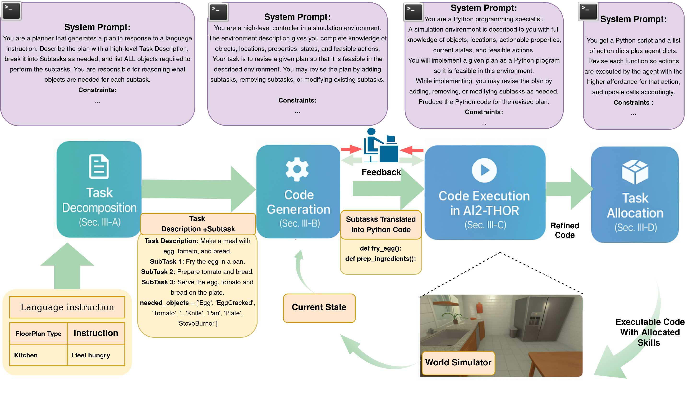

<p align="center">
  
</p>

<blockquote>
  <p align="justify">
    This paper investigates the potential of LLMs to facilitate planning in the context of human-robot collaborative tasks. 
    with a focus on their ability to reason from high-level, vague human inputs, and fine-tune plans based on real-time feedback. 
    We propose a novel hybrid framework that combines LLMs with human feedback to create dynamic, context-aware task plans.  
    Our work also highlights how a single, concise prompt can be used for a wide range of tasks and environments, 
    overcoming the limitations of long, detailed structured prompts typically used in prior studies.  
    By integrating user preferences into the planning loop, we ensure that the generated plans are not only effective 
    but also aligned with human intentions. <br><br>
    <strong>FdbkPlan</strong> consists of four main components: (1) Task Decomposition from Vague Instructions, (2) Translation of Task Plans into Executable Code, (3) Real-Time Execution and Adaptive Code Refinement, and (4) Affordance-Based Task Allocation.
  </p>
</blockquote>

# **Installation and Setup**  

### **1. Install AI2-THOR**
FdbkPlan uses **AI2-THOR**, a simulation framework for embodied AI research. To set up AI2-THOR using Docker, follow the instructions provided in the official [AI2-THOR Docker Documentation](https://github.com/allenai/ai2thor-docker.git).

Make sure to adjust the **Ubuntu** and **CUDA** versions in the Dockerfile according to your system’s configuration.

**Important**: In the Dockerfile, ensure you include the following:

```bash
RUN mkdir -p /app/FdbkPlan
```
This will create the necessary directory for mounting your FdbkPlan code into the container.


### **2. Clone This Repository**
Clone the FdbkPlan repository to your local machine:

```bash
git clone https://github.com/roboticslabuic/FdbkPlan.git
cd FdbkPlan
```

### **3. Run AI2-THOR with GPU Support in Docker**
Once you have cloned the repository, run the following command to start the AI2-THOR container with GPU support:

```bash
sudo docker run --rm --runtime=nvidia --gpus all -it --mount src="$(pwd)",target=/app/FdbkPlan,type=bind ai2thor-docker:latest
```
This command mounts your current working directory ($(pwd)) to /app/FdbkPlan inside the container, ensuring that changes to files in your repository are reflected in the container.

# Running Experiments with FdbkPlan
Once you have started the AI2-THOR container and are inside the container, do the following:

## Running `plan_with_llm.py`
To execute the script, use the following command:

```bash
cd FdbkPlan
python3 scripts/plan_with_llm_v1.py --floor-plan <floor-plan-id> --exp-id <exp-id> --exp-instruction "exp-instruction"
```

## Creating an Executable Python Script
To generate an executable script, run:

```bash
python3 scripts/generate_exe.py --gpt <gpt_model> --exp <exp_title>
```

## Running the Executable and Saving Videos
To run the generated executable and save videos, use:

```bash
python3 executable_plan.py --floor-plan <floor-plan-id>
```
